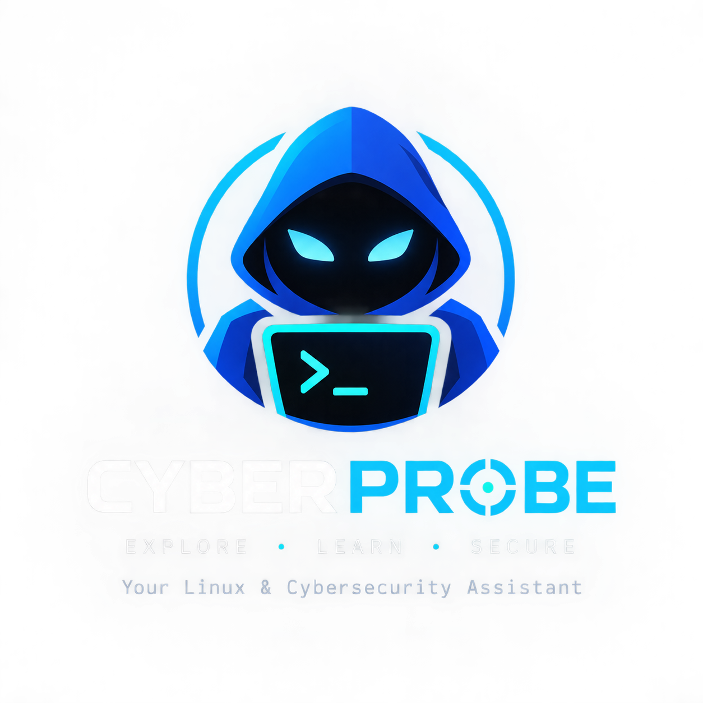

<p align="center">
  
</p>

<h1 align="center">CyberProbe</h1>

<p align="center">
  Your Linux & Cybersecurity Assistant
</p>


# Beginner Cybersecurity Assistant (MVP)

A CLI chat agent that runs approved nmap scans, Linux host inspection
commands, and file forensics tools, then explains the results in plain
language for someone with zero security background.

## Installation

CyberProbe runs on Linux with Python 3.10 or newer. Clone the repository and
create an isolated virtual environment:

```bash
git clone https://github.com/YOUR-USERNAME/CyberProbe.git
cd CyberProbe
python3 -m venv venv
source venv/bin/activate
python -m pip install -r requirements.txt
python main.py
```

On the first run, paste a Groq API key when prompted. Get one from
https://console.groq.com. CyberProbe stores it locally in
`~/.cyberprobe_groq_api_key` with restricted permissions.

Check available system tools from the CyberProbe prompt:

```text
check setup
install nmap
```

Installation always displays the exact package-manager command and asks for
confirmation before using `sudo`. It supports `apt`, `dnf`, and `pacman`; it
does not execute arbitrary package names or shell commands.

If a tool is missing, install one of CyberProbe's approved packages:

```text
cyberprobe> install nmap
```

The installer supports `apt`, `dnf`, and `pacman`, shows the command, and asks
for confirmation before using `sudo`.

## Install on Windows 11 with Kali WSL

CyberProbe is designed for a Linux shell. On Windows 11, the recommended path is
to run it inside Kali Linux on WSL.

From Windows PowerShell, install Kali WSL:

```powershell
wsl --install -d kali-linux
```

Open Kali Linux, then install the basic dependencies and clone CyberProbe:

```bash
sudo apt update
sudo apt install -y git python3 python3-venv python3-pip
git clone https://github.com/YOUR-USERNAME/CyberProbe.git
cd CyberProbe
python3 -m venv venv
source venv/bin/activate
python -m pip install -r requirements.txt
python main.py
```

On the first run, paste your Groq API key when prompted. CyberProbe saves it in
your Kali home directory at `~/.cyberprobe_groq_api_key`.

Optional: enable the terminal companion from inside CyberProbe:

```text
deploy terminal companion
```

Then close and reopen Kali. You can use:

```bash
cyberprobe help
cyberprobe list all files in home
```

WSL note: Kali's Linux home folder is separate from your Windows user folder.
Your Linux files live under paths such as `~/Documents`. Your Windows files are
usually available under `/mnt/c/Users/<WindowsUsername>/`, for example:

```bash
ls -la /mnt/c/Users/<WindowsUsername>/Desktop
```

When a common Linux folder such as `~/Desktop`, `~/Documents`, or `~/Downloads`
does not exist in Kali WSL, CyberProbe tries to use the matching Windows folder
automatically when exactly one clear match is available.

## Quick start

```text
cyberprobe> help
cyberprobe> show listening ports
cyberprobe> analyze this file /path/to/evidence.bin
cyberprobe> check setup
```

## What it can do

The Recon Agent uses named capabilities from a fixed allowlist and never
constructs raw shell commands. Capabilities include:

- Host discovery with `nmap` and `arp-scan`
- IP and DNS resolution with Python socket, `getent`, `dig`, `host`, and `nslookup`
- Common, full-TCP, and selected-port scans with `nmap`
- Service, version, banner, and OS detection with `nmap` and netcat
- HTTP headers, methods, technologies, and resources with `curl`, WhatWeb, and nmap NSE
- SSH, FTP, SMB, and HTTP service enumeration

If a scan needs root, the agent asks for your explicit yes/no
confirmation in the terminal, then runs `sudo nmap ...` directly --
sudo prompts you for your password itself. The script never sees or
stores your password.

The Linux System Agent can run a fixed allowlist of Linux inspection tools
for system information, processes, storage, users, permissions, services,
networking, logs, and health checks. It does not build raw shell commands.

The Terminal Operations Agent gives the companion a controlled way to work
with the local Linux shell. It understands navigation, listing and searching,
file creation/copy/move/removal/editing, package management, permissions,
processes, and services. Read-only operations run through an allowlist; every
change such as `rm`, `apt install`, `chmod`, `kill`, or stopping a service
shows the exact command and requires confirmation. It never runs arbitrary
shell strings or pipelines.

Terminal requests use a structured plan: the LLM maps natural language to
approved operations and parameters, the Terminal Agent validates that plan,
and the executor builds the command locally. User wording is not hardcoded as
individual command phrases, and model-generated shell text is never executed.

The Forensics Agent supports file and forensic-image analysis:

- File identification, metadata, hashing, readable strings, and embedded-file carving
- Memory-image analysis and memory strings
- Disk partition and filesystem inspection
- Recursive filesystem entry listing, data carving, and deleted-file recovery

All inputs are staged and hashed before analysis. Carved and recovered files are
written to separate folders under `~/forensics_evidence`; the original input is
not modified.

The Defensive Security Agent performs read-only local defensive analysis:

- System and authentication log review
- Failed-login, process, service, connection, and listening-port investigation
- Firewall, audit, scheduled-task, and service posture checks
- File metadata and SHA-256 evidence checks
- Threat-detection, threat-hunting, IOC, incident-investigation, and remediation guidance

Ask `investigate this Linux host for suspicious activity` to collect a bounded
defensive snapshot across logs, authentication, processes, services, network
connections, firewall state, scheduled tasks, and audit status. The agent
correlates the results into observations, findings, evidence, severity,
confidence, and recommended next steps.

The first defensive version does not change firewall rules, isolate hosts,
kill processes, delete or quarantine files, disable accounts, or run arbitrary
commands. It prepares evidence and recommendations for those response actions.

The Web Security Agent performs web application security testing using
bug bounty methodology:

- **Recon**: subdomains (subfinder), directories (gobuster), API paths (ffuf)
- **Passive**: headers, cookies, CORS, TLS, robots.txt, technology fingerprint
- **Input probes**: GET query, POST form, and POST JSON reflection/SQL/XSS detection (candidates only)
- **Burp HAR/XML import**: `analyze_traffic_file`, `analyze_burp_xml_file`, `har_automated_probes`
- **Burp proxy routing**: set `use_burp_proxy=true` to send checks through `127.0.0.1:8080`
- **IDOR testing**: `idor_dual_session_check` with two session cookies
- **Deeper hunting**: `nuclei_web_scan` with web template tags
- **Lab exploit PoC** (gated): `lab_exploit_poc` with terminal confirmation

Export from Burp: Proxy → HTTP history → Save items → HAR. Then ask CyberProbe:
`analyze this HAR file /path/to/export.har`

POST/JSON probe examples:
`run post_json_sql_error on https://lab/api/user parameter id`

Trigger a phased workflow with: `full web assessment on https://your-lab-target`

Optional tools: `gobuster`, `ffuf`, `subfinder`, `whatweb` (install as needed;
`check setup` shows availability).

## Terminal companion

Inside CyberProbe, run `deploy terminal companion` and confirm the installation.
After opening a new Bash or Zsh terminal, both forms are available:

```text
$ analyze this file sample.pdf
$ cyberprobe analyze this file sample.pdf
```

The companion forwards natural-language requests to the same Orchestrator and
specialist agents. Real commands remain normal shell commands. For CyberProbe
terminal actions, the companion captures the command status and prints a short
plan/results explanation after execution.

**Observe and explain** (for commands you paste yourself, such as `ping` or
`curl`):

```text
$ cyberprobe observe on
$ ping 8.8.8.8
$ cyberprobe explain
```

- `observe on/off/status` — opt-in capture of the **last** command’s output in
  **this shell tab only** (new tabs start with observe OFF).
- `explain` — sends that capture to the AI for a plain-language breakdown
  (long output is processed in sections and combined).
- Interactive commands (`vim`, `ssh`, `msfconsole`, etc.) are **not** captured.
- `auth on/off` is separate: it only gates mutating operations, not observe.

For local terminal operations, the companion now proposes the exact shell
action and asks before running it in the current shell:

```text
$ cyberprobe go to Documents and list what is there
Proposed terminal action:
cd -- /home/you/Documents
ls -la -- /home/you/Documents

Run? [y/N]
```

Approving the action with `y` means stateful shell operations such as `cd`
affect the terminal you are using, not a Python child subprocess. After the
raw command output, CyberProbe prints a summary showing the command, return
code, what completed, and what failed.

The hook is visible in `~/.bashrc` or `~/.zshrc`, can be removed manually using
the CyberProbe companion markers, and requires a new terminal after deployment.

Terminal changes from the shell companion require a per-action `Run? [y/N]`
approval. The older `cyberprobe auth on/off/status` switch is still available
for terminal operations that run inside the main CyberProbe app process.

Temporarily disable the companion itself with `cyberprobe companion off`,
re-enable it with `cyberprobe companion on`, and check it with
`cyberprobe companion status`. Re-run `deploy terminal companion` after updates;
it refreshes the existing shell hook instead of leaving an old copy in place.

## Safety guardrails in this MVP

- **Authorization**: only scan or test systems you own or have explicit
  permission to assess. CyberProbe accepts any valid IP, hostname, or URL.
- **Scan allowlist**: the LLM picks from fixed check types, never raw
  flags or a free-form command string.
- **Timeouts**: every scan is capped (default 10 minutes) so nothing
  can hang forever.
- **No password handling**: root scans go through `sudo`'s own secure
  prompt, never through the Python code.
- **Saved API key**: the Groq API key is stored locally in
  `~/.cyberprobe_groq_api_key` after the first entry so later runs start
  immediately.

## Project structure

```
main.py              CLI entry point / chat loop
orchestrator.py      Routes user intent to specialist agents
recon_agent.py       Network recon specialist
web_security_agent.py Web application security specialist
forensics_agent.py   File forensics specialist (exiftool/binwalk/etc.)
linux_agent.py       Linux host inspection specialist
terminal_agent.py    Controlled terminal operations specialist
defensive_agent.py   Defensive monitoring and incident investigation specialist
security_tools.py    Target validation + recon execution
web_security_tools.py Web security allowlist + execution
forensics_tools.py   File staging + forensics tool execution
linux_tools.py       Linux command allowlist + execution
terminal_tools.py    Terminal operation allowlist + execution
defensive_tools.py   Defensive command allowlist + execution
terminal_companion.py Bash/Zsh terminal companion deployment and bridge
tool_installer.py    Approved system-tool installation
llm_config.py        Shared Groq client and model config
logger.py            JSONL session logging
requirements.txt
```

## Architecture

```
CYBERPROBE
    │
ORCHESTRATOR
    │
┌───┴───────────┐
▼               ▼
RECON AGENT     FORENSICS AGENT
    │               │
    ▼               ▼
security_tools   forensics_tools
    │               │
  nmap         file/exiftool/binwalk/strings/sha256sum
```
# cyberprobe

## Today's platform additions

CyberProbe now includes the foundation for coordinated, extensible security
investigations:

- Structured intent understanding for goals, target types, constraints,
  priorities, depth, and output style.
- Investigation planning with create, revise, pause, resume, phase completion,
  and progress tracking.
- A task manager with queued, running, completed, failed, and blocked tasks,
  including dependencies, retries, and error state.
- A Tool Registry and Tool Adapter system that separates tool capabilities from
  command construction and parsing.
- A Tool Engine that selects available tools by capability and provides
  fallbacks.
- Adapters for Nmap, Masscan, RustScan, arp-scan, Nuclei, Nikto, HTTPX,
  WhatWeb, Gobuster, and FFUF.
- Dependency inventory with executable paths, installed versions, and missing
  tool detection.
- Output parsers for Nmap XML, Nuclei JSONL, HTTPX, Nikto, Gobuster, FFUF, and
  Metasploit-style console output.
- A shared evidence graph for assets, ports, services, technologies,
  endpoints, vulnerabilities, findings, and relationships.
- Cross-tool correlation that merges duplicate findings, combines evidence,
  tracks source tools, and increases confidence when independent tools agree.
- Structured investigation events for agent handoffs, task status, tool
  results, evidence, findings, failures, and coordination history.
- Shared orchestrator state connecting intent, plans, tasks, evidence, agent
  outputs, correlation, and reporting.

These additions are an extensible development foundation. The next work is to
connect every specialist agent fully to the task and event systems, improve
tool-specific parsers with real fixtures, add persistent case storage, expand
automated tests, and complete end-to-end workflow testing.
